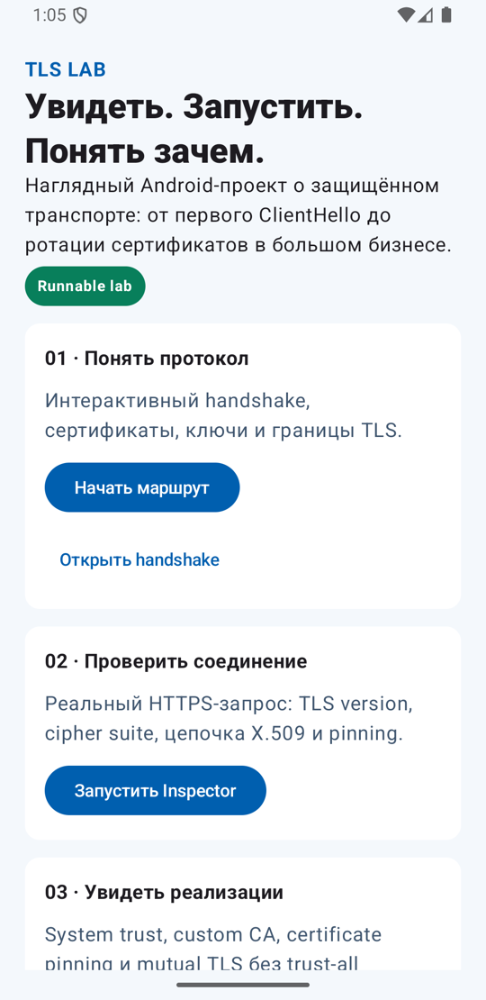
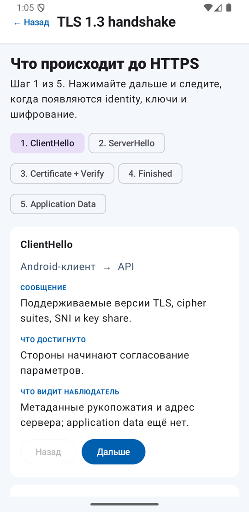
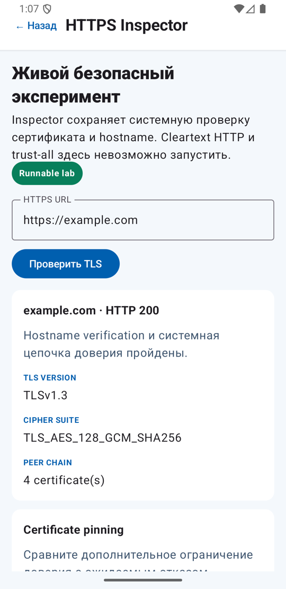
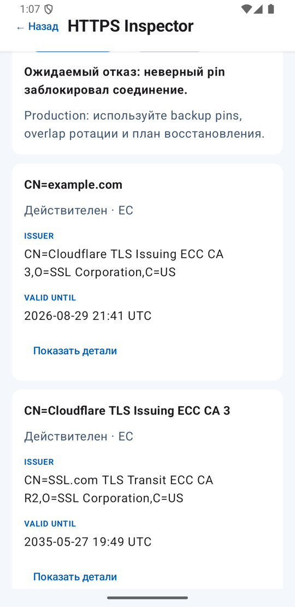
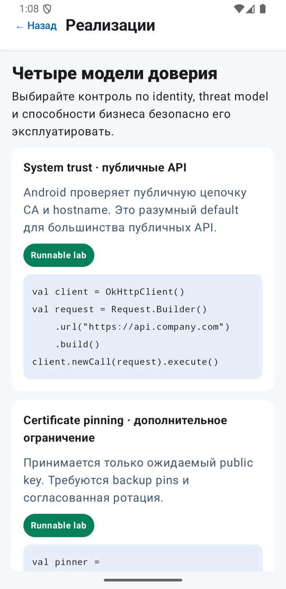
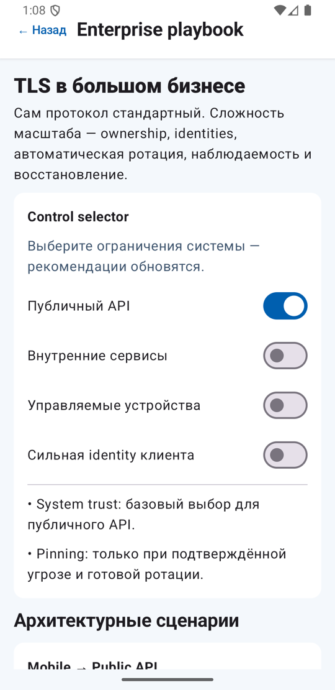
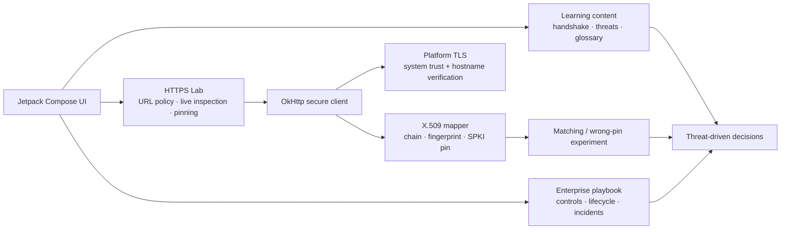

<div align="center">

# TLS Lab for Android

**Увидеть, запустить и понять TLS: от первого `ClientHello` до ротации сертификатов в большом бизнесе.**


Наглядный Jetpack Compose-проект с интерактивным TLS 1.3 handshake, реальным HTTPS Inspector, безопасным certificate-pinning экспериментом и enterprise playbook.

<a href="docs/screenshots/home.png"></a>

</div>

## Что здесь можно сделать

| Возможность | Что она показывает |
| --- | --- |
| **Интерактивный TLS 1.3 handshake** | Когда появляются identity, общий секрет, шифрование и защищённый HTTP-трафик. |
| **Живой HTTPS Inspector** | Реальный TLS version, cipher suite, hostname verification и цепочку X.509 сертификатов. |
| **Safe pinning lab** | Matching pin разрешает соединение, wrong pin даёт ожидаемый безопасный отказ. |
| **Реализации** | System trust, restricted custom CA, certificate pinning и mTLS без trust-all shortcuts. |
| **Enterprise playbook** | Edge termination, service mTLS, zero trust, ownership, ротацию и incident response. |

## Посмотреть проект

<table>
  <tr>
    <td width="50%" valign="top">
      <a href="docs/screenshots/handshake.png"></a>
      <br><strong>TLS 1.3 без магии</strong><br>
      Каждый шаг объясняет сообщение, полученную гарантию и то, что всё ещё видит сетевой наблюдатель.
    </td>
    <td width="50%" valign="top">
      <a href="docs/screenshots/https-inspector.png"></a>
      <br><strong>Реальное безопасное соединение</strong><br>
      Inspector сохраняет системную проверку сертификата и hostname и показывает результат живого HTTPS handshake.
    </td>
  </tr>
  <tr>
    <td width="50%" valign="top">
      <a href="docs/screenshots/wrong-pin.png"></a>
      <br><strong>Pinning должен ломаться безопасно</strong><br>
      Намеренно неверный pin блокирует соединение и помогает понять цену дополнительного ограничения доверия.
    </td>
    <td width="50%" valign="top">
      <a href="docs/screenshots/implementations.png"></a>
      <br><strong>Реализации, а не только теория</strong><br>
      Кодовые walkthroughs явно отмечены как runnable lab, conceptual material или production guidance.
    </td>
  </tr>
  <tr>
    <td width="50%" valign="top">
      <a href="docs/screenshots/enterprise.png"></a>
      <br><strong>TLS в большом бизнесе</strong><br>
      Control selector связывает публичные API, private services, managed devices и client identity с подходящими контролями.
    </td>
    <td width="50%" valign="top">
      <a href="docs/screenshots/home.png"></a>
      <br><strong>Один связный учебный маршрут</strong><br>
      От threat model и handshake до безопасной эксплуатации сертификатов на масштабе.
    </td>
  </tr>
</table>

## Как устроен проект



Приложение разделяет три вещи, которые часто смешивают:

- **Факты протокола** — что TLS гарантирует и где заканчиваются его границы.
- **Runnable lab** — безопасные эксперименты с реальным HTTPS и pinning.
- **Production guidance** — как выбирать и эксплуатировать system trust, private CA и mTLS.

## Зачем это бизнесу

TLS защищает токены, персональные и платёжные данные в недоверенной сети. На масштабе сложность находится не в одном вызове `SSLContext`, а в управлении тысячами identities и сертификатов:

- назначить владельцев доменов, сертификатов и политик;
- хранить приватные ключи в Android KeyStore, KMS или HSM;
- автоматически выпускать и ротировать сертификаты без downtime;
- переживать app-release lag и ошибки pinning;
- наблюдать expiry, handshake failures, cipher inventory и Certificate Transparency;
- быстро локализовать компрометацию и восстановить доверие.

Публичные mobile API обычно начинают с **system trust**. **Private CA** применяют для внутренних identities. **mTLS** нужен, когда сервер обязан криптографически проверить клиента или workload. **Pinning** используют только при подтверждённой threat model и готовой процедуре ротации.

## Границы безопасности

- Приложение принимает только HTTPS URL.
- Проверка цепочки сертификатов и hostname никогда не отключается.
- Trust-all показан только как неисполняемый anti-pattern.
- Private CA и mTLS walkthroughs не содержат встроенных приватных ключей.
- Реальный network smoke test отключён по умолчанию, чтобы обычные тесты не зависели от интернета.

## Запуск

```bash
./gradlew :app:assembleDebug
adb install -r app/build/outputs/apk/debug/app-debug.apk
```

Проверки проекта:

```bash
./gradlew :app:testDebugUnitTest
./gradlew :app:lintDebug
./gradlew :app:connectedDebugAndroidTest
```

Opt-in real HTTPS smoke test передаёт instrumentation argument `runTlsSmoke=true`; используйте его только на устройстве с доступом в интернет.

## Обновление скриншотов

Галерея состоит из реальных состояний приложения и хранится внутри репозитория. Фиксированная конфигурация эмулятора, capture-команды, стабильные имена файлов и privacy checklist описаны в [руководстве по обновлению скриншотов](docs/screenshots/README.md).
